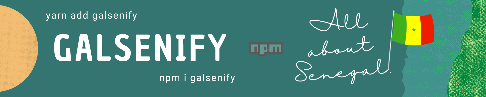

# Galsenify 📦💫



**Galsenify** est un package qui vous facilite la manipulation de données sur le Sénégal.  
Il offre une multitude d'information sur le Sénégal.

- Version actuelle ➡️ 1.0.0

## Installation 📥

`via NPM`

```bash
npm i galsenify
```

`via YARN`

```bash
yarn add galsenify
```

`via PNPM`

```bash
pnpm i galsenify
```

## Utilisation 💡

```js
import galsenify from "galsenify";
// ou
const galsenify = require("galsenify");

console.log(galsenify.regions());

// resultats
[
  "Dakar",
  "Diourbel",
  "Fatick",
  "Kaffrine",
  "Kaolack",
  "Kédougou",
  "Kolda",
  "Louga",
  "Matam",
  "Saint-Louis",
  "Sédhiou",
  "Tambacounda",
  "Thies",
  "Ziguinchor",
];
```

## Liste des commandes disponibles 🧩

```js
// Obtenez toutes les données sur le Sénégal.
console.log(galsenify.sn());

// Obtenez toutes les langues nationales.
console.log(galsenify.languesNationales());

// Obtenez toutes les données sur les régions.
console.log(galsenify.rg());

// Obtenez la listes de toutes les régions.
console.log(galsenify.regions());

// Obtenez les départements par région.
// remplacer "region" par une région existante (exemple : Dakar)
console.log(galsenify.departments("region"));

// Obtenez le nombre d'habitants par région.
// remplacer "region" par une région existante (exemple : thies)
console.log(galsenify.population("region"));

// Obtenez la superficie par région.
// remplacer "region" par une région existante (exemple : KAOLACK)
console.log(galsenify.superficie("region"));

// Obtenez le code de toutes les régions.
console.log(galsenify.codes());
```

### Exemple ✅

**[Galsenify Demo](https://github.com/daoodaba975/galsenify.demo)** est un projet démo pour vous montrer comment utiliser le package Galsenify dans un projet Next.js présenté lors de l'événement #LiveKoorGalsenDEV, vous pouvez voir en ligne [ici](https://galsenify.vercel.app).

### Auteur 🌟

[](https://github.com/daoodaba975)  
Créé par **[Daouda BA](https://github.com/daoodaba975)**

Vous pouvez m'offrir un café ☕ et aider le projet à grandir 🙌🏾

<a href="https://www.buymeacoffee.com/daoodaba975" target="_blank"></a>

### Contribution 🌍

⚠️ Si vous souhaitez contribuer sur ce projet, veuillez d'abord consulter le **[Guide de Contribution](../CONTRIBUTING.md)**.

Si vous trouvez un 🐞 (bug) ou que vous avez une 💡 (idée) sur l'évolution de ce projet, vous pouvez ouvrir une **[issue](https://github.com/daoodaba975/galsenify/issues/new)**.  
Je suis également disponible sur **[Twitter](https://twitter.com/daoodaba975)**.

Un merci spécial à [Dame LEYE (Honorable Con)](https://github.com/honorableCon) pour sa contribution sur ce projet.

[](https://github.com/honorableCon)

Merci à tous les contributeurs 👏🏽

<a href="https://github.com/daoodaba975/galsenify/graphs/contributors">
  
</a>

#### Changelog 🔁

Vous pouvez aussi consulter le **[Changelog](../CHANGELOG.md)** pour voir les différentes changements et évolutions entre les versions.

#### License 🎫

Ce package est publié sous **[License MIT](../LICENCE.md)** ✔

[](https://github.com/GalsenDev221/made.in.senegal)
